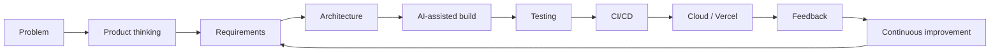
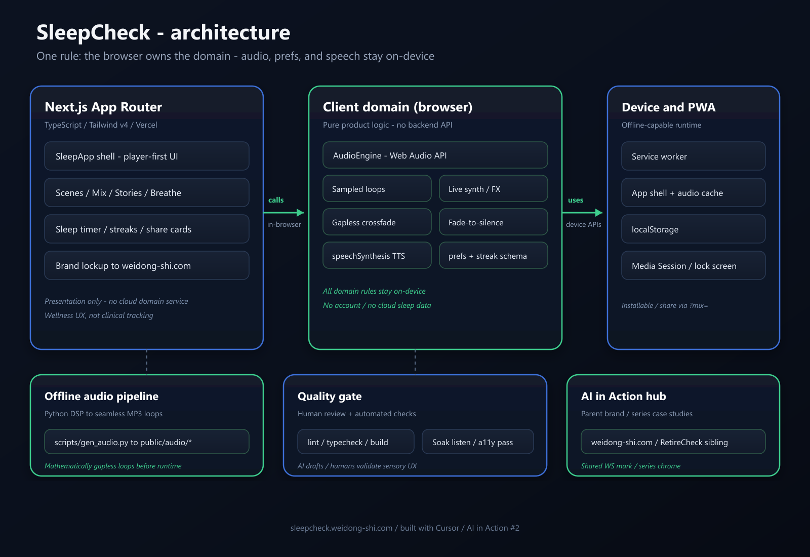
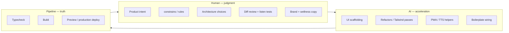
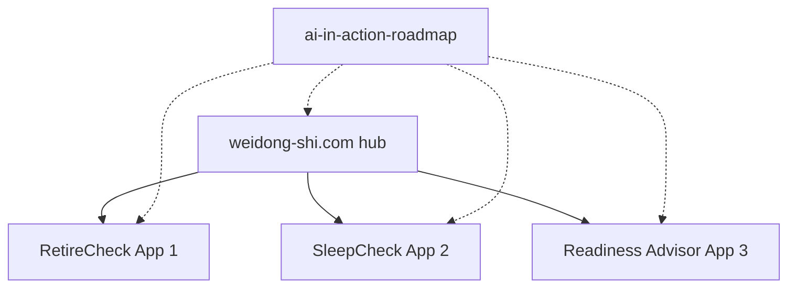

# SleepCheck architecture

SleepCheck is a local-first wind-down companion in the **AI in Action** series. The live product is the demonstration; the engineering process — intent, boundaries, review, and shipping — is the durable product.

- **Live:** https://sleepcheck.weidong-shi.com  
- **Hub:** https://weidong-shi.com  
- **Source:** https://github.com/weidong808/SleepCheck  
- **Series roadmap:** https://github.com/weidong808/ai-in-action-roadmap  

> **Wellness disclaimer:** SleepCheck is not medical advice and not a treatment for sleep disorders. It does not perform clinical sleep tracking.

---

## 1. Product journey

From idea to continuous improvement:



ASCII equivalent:

```
Problem → Product thinking → Requirements → Architecture
        → AI-assisted development → Testing → CI/CD → Cloud
        → Feedback → Continuous improvement ──┐
                    ▲─────────────────────────┘
```

| Stage | SleepCheck focus |
|--------|------------------|
| Problem | Night-time calm without accounts or dashboards |
| Product thinking | Player-first, local-first, natural soundscapes + stories |
| Requirements | Offline-capable PWA, gapless audio, shareable mixes, brand parity with RetireCheck |
| Architecture | Next.js client + Web Audio + localStorage + service worker |
| AI-assisted build | Intent-driven prompts inside written constraints |
| Testing | Preference/mix contracts, audio resume, soak listens |
| CI/CD | Typecheck, build, preview → production |
| Cloud | Vercel + custom domain under weidong-shi.com |
| Feedback | Scene clarity, lock-screen controls, share fidelity |
| Continuous improvement | Roadmap-driven polish, not “add another AI feature” |

---

## 2. Client architecture

SleepCheck is intentionally **client-heavy**. There is no separate calculation API (contrast with RetireCheck’s ASP.NET domain). Runtime “domain” lives in the browser.



*One rule: the browser owns the domain — audio, prefs, and speech stay on-device.*

Source diagram: [`sleepcheck-architecture.svg`](./sleepcheck-architecture.svg)
### Key modules

| Area | Responsibility |
|------|----------------|
| `SleepApp` / pages | Player-first UI: scenes, mix, timer, stories, breathe |
| `audioEngine.ts` | Web Audio graph: sampled ambience, live noise/binaural, crossfade loops, fade-to-silence |
| `sounds.ts` / `public/audio/` | Sound catalog + offline-rendered MP3 loops |
| `stories.ts` + `speech.ts` | Story content + device TTS pacing / narrator selection |
| `storage.ts` | Versioned preferences schema in `localStorage` |
| `public/sw.js` | Installable offline shell and cached audio |
| `brand.ts` | Shared AI in Action naming, hub URL, RetireCheck sibling link |

### Data & privacy

- Preferences and streaks stay on-device (`sleepcheck.preferences.v1`).
- No accounts, no cloud database, no microphone/wearable tracking.
- Shareable mixes use query strings (`?mix=rain:0.50,fire:0.42`), not a backend playlist store.

### Audio pipeline (simplified)

```
MP3 loops (public/audio) ──decode──┐
                                   ├→ per-source GainNode → master → shelf → compressor → destination
Live synth (noise / binaural) ─────┘
```

Loops are generated offline (`scripts/gen_audio.py`) with circular FFT filtering for seamless joins. The engine crossfades loop passes and trims encoder padding so playback stays gapless.

---

## 3. Human vs AI responsibilities



| Role | Owns |
|------|------|
| **Human** | Problem framing, player-first UX, local-first boundary, mix URL contract, streak definition, audio quality bar, wellness disclaimer, brand alignment with RetireCheck |
| **AI (Cursor)** | Component iteration, layout polish, service-worker/manifest wiring, TTS helpers, repetitive refactors inside those constraints |
| **Pipeline** | Typecheck, production build, Vercel preview/production — “Cursor proposes; git and CI dispose” |

Philosophy: AI changes **where** engineers spend time. The app is the demo; the process is the product.

---

## 4. Platform evolution toward AI in Action

SleepCheck is **#2** in a growing portfolio of production case studies under one parent brand.



ASCII equivalent:

```
                    +---------------------+
                    |   weidong-shi.com   |
                    |   AI in Action hub  |
                    +----------+----------+
      +----------------+-------+-------+----------------+
      v                v               v                v
 RetireCheck #1   SleepCheck #2   Readiness #3    (roadmap)
 (C# domain+API)  (PWA + audio)   (gates + RAG)
```

### Shared series patterns

- Parent brand chrome and hub linking (`brand.ts` / site case studies)
- Methodology: **Build → Validate → Improve → Document → Share**
- Intent-driven AI workflow: rules before prompts, human review, ship for real
- Production URLs under `*.weidong-shi.com`
- Case-study write-ups on the hub (LinkedIn drafts follow when ready)

### Deliberate divergence

| | RetireCheck | SleepCheck | Readiness |
|---|-------------|------------|-----------|
| Core risk | Incorrect financial math | Audio glitches / broken calm UX | Inflated readiness / false certification |
| Architecture | Pure C# domain + API | Browser Web Audio + local storage | Deterministic scoring + advisory LLM |
| Auth / data | Stateless API calls | No accounts; device-local prefs | Browser-held answers; transient server |
| Deploy | Vercel + Render | Vercel PWA | Vercel |

Same series thesis, domain-appropriate architecture.

---

## Related links

- Live app: https://sleepcheck.weidong-shi.com  
- Hub: https://weidong-shi.com  
- Hub case study: https://weidong-shi.com/work/sleepcheck  
- Hub insight: https://weidong-shi.com/insights/ai-in-action-sleepcheck  
- LinkedIn article: https://www.linkedin.com/pulse/ai-action-2-from-idea-sleepcheck-weidong-shi-0fwrc  
- RetireCheck: https://weidong-shi.com/work/retirecheck  
- Readiness: https://weidong-shi.com/work/readiness  
- Roadmap: https://github.com/weidong808/ai-in-action-roadmap  
